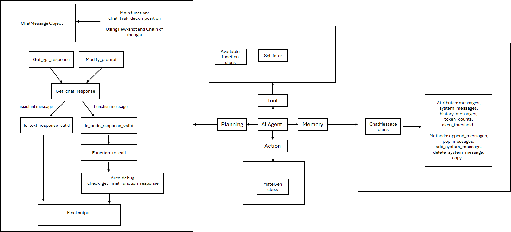
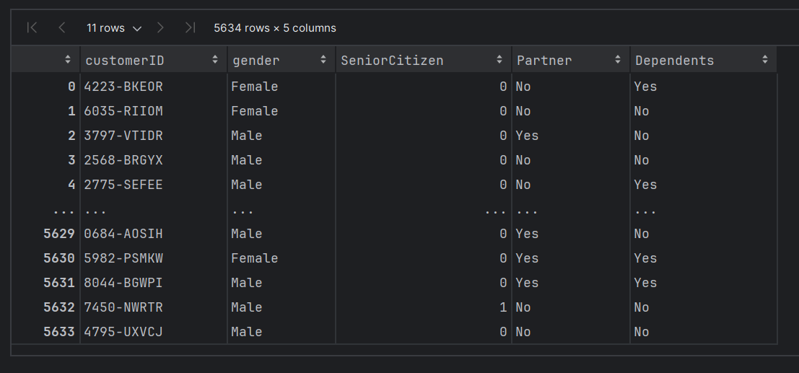

# AI code agent

# Background

Shortly after the birth of ChatGPT Code Interpreter, various open-source applications of code interpreters have sprung up like mushrooms after the rain. The aim of these open-source projects is to address some of the issues present in ChatGPT Code Interpreter. Among the numerous open-source code interpreter projects, the two most noteworthy, highest-rated, and best-performing projects are DB-GPT and Open Interpreter. Both projects allow the locally-run execution of code created by large models (i.e., running in a local environment) and support both GPT models and open-source models. However, the difference is that Open Interpreter is a more lightweight application, which can almost be seen as a locally runnable ChatGPT Code Interpreter. Similar to Auto-GPT, it supports interaction with the local computer environment and serves as a lightweight intelligent assistant.

Open-Interpreter project link: https://github.com/KillianLucas/open-interpreter

It needs to be able to smoothly execute the entire data analysis process: specifically, it should be able to directly extract data from (relational) databases, then perform data analysis and modeling in a local environment, and finally produce an analysis report of the data analysis and modeling results.

The data analysis process of the code interpreter must have a certain level of professionalism and "imitation ability": In most enterprises, the process of data analysis and conclusion generation is not a completely independent creative process, but rather one that builds on a large amount of previous internal analysis methods and ideas to ensure the correctness of the analysis process and results. The code interpreter itself must have strong extensibility in natural language programming: In addition, we hope that the large model behind this code interpreter has malleable natural language programming capabilities. That is, in this code interpreter process, we can optimize and improve the natural language programming capabilities of the large model through the design of reasonable multi-stage prompts or self-checking code processes, to further enhance the effectiveness of the code interpreter.

The interaction method of the code interpreter itself must be very convenient: Lastly, we hope that the interaction logic of this code interpreter is very user-friendly for analysts. Specifically, we hope to design a process where each stage is individually prompted and results are reviewed before being sequentially written into the analysis report, thereby improving the quality of the analysis report itself. 

In this project, our code agent has the following features: 

1) It needs to understand human intentions to a certain extent and have a certain level of "self-awareness" to automatically recognize questions it cannot answer and further inquire about the user's question intent.

2) For general questions, the model's performance can be enhanced by adjusting parameters, choosing whether to decompose the question, or adding COT prompts.

3) If the user is not satisfied with the answer, they can interactively modify the answer.

4) When calling external tools, it needs to be able to perform fully automated execution around the goal, rather than executing around a specific step. For example, when we ask the Code Agent to check if the data volumes of various tables in the telco_db database are consistent, we hope the Code Agent can automatically read the four tables step by step, perform data volume statistics, compare the data, and then return the results. This entire process should involve multiple function calls being completed automatically without external prompts or intervention.

5) Additionally, we need the Planning module of the Code Agent to have code review and debugging capabilities, i.e., it should be able to debug the code written by the large model and ensure that external functions run smoothly and produce results.

---

### 1、Structure of the project

```text
.
├── MateGen.py                     # action module 
├── README.md                      # readme file
├── availablefunctions.py          # functions to use 
├── chatmessage.py                 # memory module to store chat messages and system messages
├── telco_data                     # data folder
│   ├── test.cvs                   # test data sets
│   ├── train.cvs                  # train data sets
│   └── WA_Fn-UseC-Telco-Customer  # the original datasets
├── gptlearning.py                 # available functions
├── interproject.py                # memory module to store long term memories using google drive
├── planning.py                    # chain of thoughts and few shot examples 
├── response.py                    # main function that is used to call api of GPT 
├── telco_data_dictonary.md        # the introduction of telco data, can be used as system message 
├── tool.py                        # tool functions 
         
```

### 2 、Introduction

#### 2.1 Strucutre of the code agent 



#### 2.2 dataset
https://www.kaggle.com/datasets/blastchar/telco-customer-churn



### 3 、Run
run create_train_test_sets.py to creat dataset and then upload those datasets to mysql


run test.py to see responses


